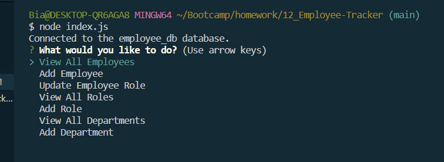

# Employee Tracker

[](http://unlicense.org/)

## Description

This is an application called the Employee Tracker. From the command line, we'll be able to keep track of employees using MySql2.

## Table of Contents

- [Installation](#installation)
- [Usage](#usage)
- [Credits](#credits)
- [License](#license)

## Installation

Step 1: log into mysql and run:

```
source db/schema.sql

source db/seeds.sql
```

Step 2: In your terminal, run:

```
npm i
```

Step 3: Once everything is installed, db is seeded, and you start the application by using:

```
node index.js
```

## Usage



To see a walkthrough of how to use the application please use the link below:  
https://drive.google.com/file/d/1gPebmQ8woKz__jjluHRcI3xliBd0yuqO/view

## Credits

Referenced back to activites  
Tutoring help (Erik Hirsch)  
Office Hour help: Keyvon (TA)

## License

This is free and unencumbered software released into the public domain.

Anyone is free to copy, modify, publish, use, compile, sell, or
distribute this software, either in source code form or as a compiled
binary, for any purpose, commercial or non-commercial, and by any
means.

In jurisdictions that recognize copyright laws, the author or authors
of this software dedicate any and all copyright interest in the
software to the public domain. We make this dedication for the benefit
of the public at large and to the detriment of our heirs and
successors. We intend this dedication to be an overt act of
relinquishment in perpetuity of all present and future rights to this
software under copyright law.

THE SOFTWARE IS PROVIDED "AS IS", WITHOUT WARRANTY OF ANY KIND,
EXPRESS OR IMPLIED, INCLUDING BUT NOT LIMITED TO THE WARRANTIES OF
MERCHANTABILITY, FITNESS FOR A PARTICULAR PURPOSE AND NONINFRINGEMENT.
IN NO EVENT SHALL THE AUTHORS BE LIABLE FOR ANY CLAIM, DAMAGES OR
OTHER LIABILITY, WHETHER IN AN ACTION OF CONTRACT, TORT OR OTHERWISE,
ARISING FROM, OUT OF OR IN CONNECTION WITH THE SOFTWARE OR THE USE OR
OTHER DEALINGS IN THE SOFTWARE.

For more information, please refer to <https://unlicense.org>

## Questions

For any questions please contact test@test.com.

You can find me on gitHub at https://github.com/luxardOri.
